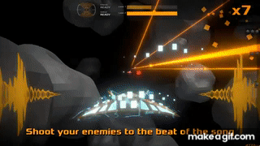

+++
title = "BeatShips"
date = 1900-12-26
+++

<html lang="en">
    

        

            
BeatShips

            
Programmer

            
Flow with the music while defeating enemies. You can use your favourite music to create and share levels with the community and also download new ones to extend your gameplay.  Complete levels and unlock new ships and skins to get new game styles and cool looks.

            

                
                
            

        

        

            
        

    

</html>
