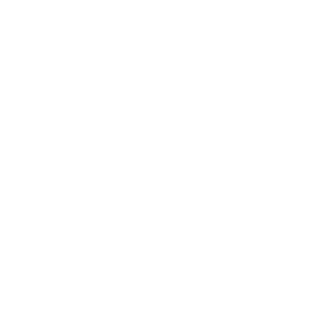

+++
title = "BeatShips"
date = 1900-12-26
+++

<html lang="en">
    

        

            
Beatships

            
Programmer

            

                
Beatships is a community oriented, rhythm based, arcade shoot'em up that allows for the creation and sharing of levels, similar to Osu.

                
This game revolves around <b>User Generated Content</b> in the form of the creation of levels and/or the music they are built into. It contains a <b>feature rich Level Editor</b>, which in tandem with the modular nature of the software and art that compose the game, allows the player to create unique experiences.

            

            

                
                
            

        

        

            
        

    

</html>
