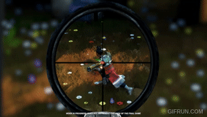

+++
title = "Domenation"
date = 1900-12-31
+++

<html lang="en">
    

        

            
        

        

            
Domenation

            
Tech Leads

            
Fast-paced third person shooter Battle Royale in a post-apocalyptic setting.  Run from the pulse into the warm embrace of the domes, but be careful, other players might do the same!

            

                
                
            

        

    

</html>
