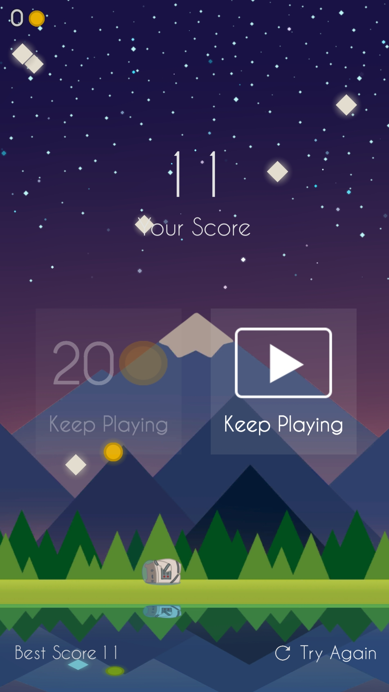

+++
title = "Falling Lights"
date = 1900-12-27
+++

<html lang="en">
    

        

            
        

        

            
Falling Lights

            
Programmer

            
Falling Lights is a cute microgame with a simple core gamelay loop and a skins store.  This game was a proof of concept and served as experience for releasing games in the PlayStore.

            

                
                
            

        

    

</html>
