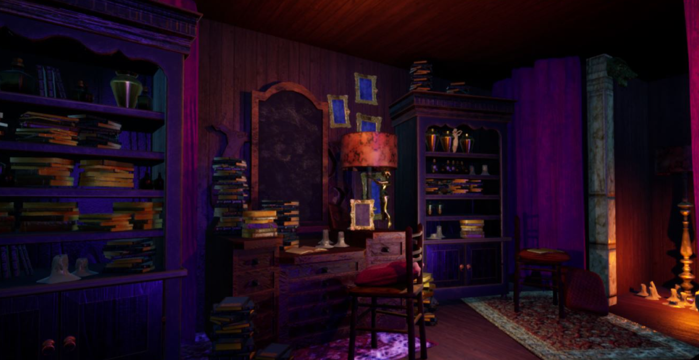

+++
title = "Maskerade"
date = 1900-12-29
+++

<html lang="en">
    

        

            
        

        

            
Maskerade

            
Programmer

            
Maskerade is a deeply narrative Survival Horror game where you play as a young girl who has been kidnapped and forced to work as a ballerina in a terrific and mysterious cabaret.  Explore and find a way to escape from the clutches of the evil Madame who runs it.

            
        

    

</html>
