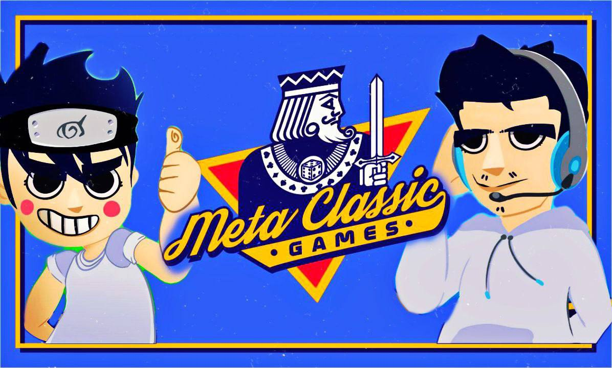

+++
title = "Meta Classic Games"
date = 1900-12-30
+++

<html lang="en">
    

        

            
Meta Classic Games

            
Senior Network Programmer

            

                
Meta Classic Games is a revolutionary hub for timeless classic games, enhanced with the power of NFTs.

                
Working on this project, I had the opportunity to master Unity's Mirror Networking package, enabling me to create a seamless, <b>cross-platform experience for players across desktop PCs, mobile devices, and web browsers</b>. This experience enhanced my understanding multiplayer networking and the intricacies of synchronizing gameplay across different platforms.

            

            

                
                
            

        

        

            
        

    

</html>
